# eProject Report: TasteFlow - Premium Food Ordering System

## Acknowledgements
I would like to express my sincere gratitude to my mentors and the development team for their guidance and support throughout the development of the TasteFlow project. This project has been a significant learning experience in building a full-stack, scalable, and user-centric web application using modern technologies.

---

## eProject Synopsis

### Project Overview
**TasteFlow** is a premium, full-stack food ordering and delivery platform designed to bridge the gap between customers, restaurant owners, and administrators. The system provides a seamless experience for customers to browse menus, place orders, and track them in real-time, while offering restaurant owners robust tools to manage their digital storefronts and orders.

### Objectives
1.  **Seamless User Experience**: Provide an intuitive and responsive interface for food discovery and ordering.
2.  **Efficient Storefront Management**: Enable restaurant owners to easily manage dishes, categories, and coupons.
3.  **Real-time Order Tracking**: Offer customers and owners live updates on order status (Pending, Preparing, Out for Delivery, etc.).
4.  **Admin Oversight**: Provide a centralized dashboard for administrators to manage users, categories, and audit system activities.
5.  **Scalable Architecture**: Use a modular Flask-based backend with a structured database to ensure long-term maintainability.

---

## eProject Analysis

### Feasibility Study

#### Technical Feasibility
The project utilizes the **Flask** web framework, which is highly flexible and scalable. **SQLAlchemy** is used for ORM, ensuring efficient database interactions. The frontend is built using **Vanilla CSS and JavaScript**, prioritizing performance and customizability without the overhead of heavy frameworks. Cloudinary is integrated for efficient image and media management.

#### Operational Feasibility
The system is designed with three distinct roles (Customer, Owner, Admin), each with a tailored dashboard. This clear separation of concerns ensures that each user type has exactly the tools they need, making the system easy to operate for all stakeholders.

#### Economic Feasibility
By automating the order management and food discovery process, RegFood reduces the need for manual order taking and physical menus, potentially increasing revenue for restaurants and providing convenience for customers.

### Requirement Analysis

#### Functional Requirements
-   **User Authentication**: Secure login, registration, and password reset functionality.
-   **Menu Management**: Owners can add, edit, and delete dishes with images.
-   **Order Processing**: Customers can place orders; owners can update order statuses.
-   **Wishlist & Favorites**: Customers can save dishes for later.
-   **Coupon System**: Owners can create and manage discount codes.
-   **Admin Panel**: Global management of categories, food types, and user accounts.

#### Non-Functional Requirements
-   **Performance**: Fast page loads optimized through efficient SQL queries and AJAX navigation.
-   **Security**: CSRF protection, password hashing (Bcrypt), and rate limiting.
-   **Responsiveness**: Mobile-first design principles ensure the app looks great on all devices.
-   **Reliability**: Robust error handling and database transaction management.

---

## eProject Design

### Data Flow Diagram (DFD) - Level 0 (Context)
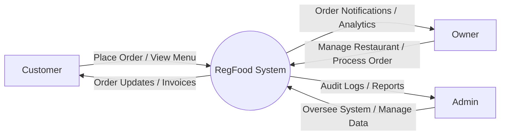

### Process Diagram
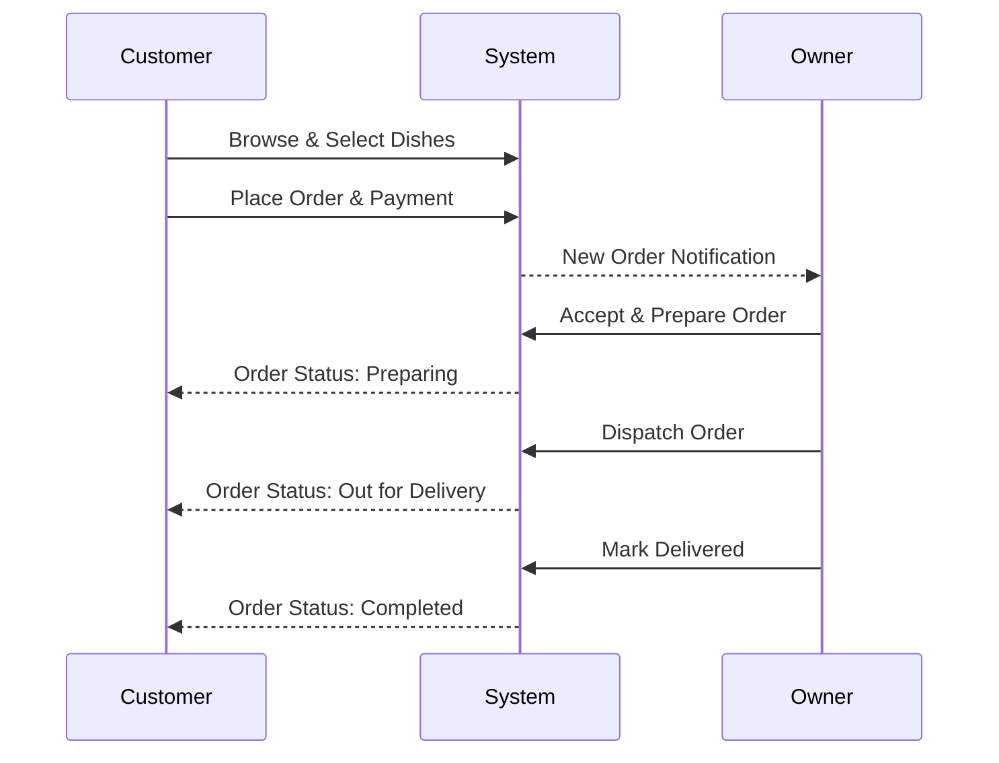

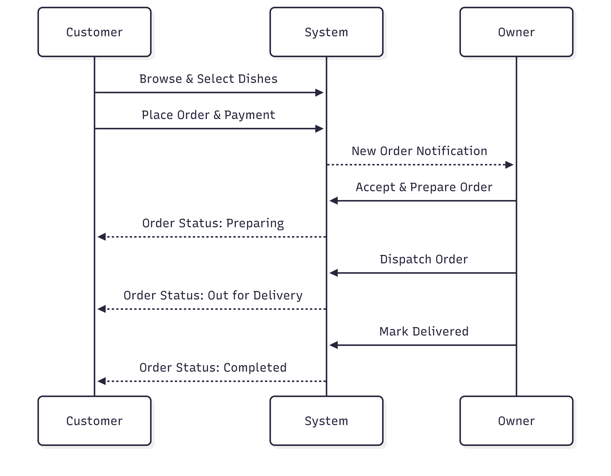

### FlowChart: User Authentication & Order Process
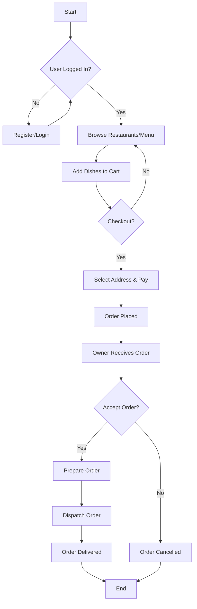
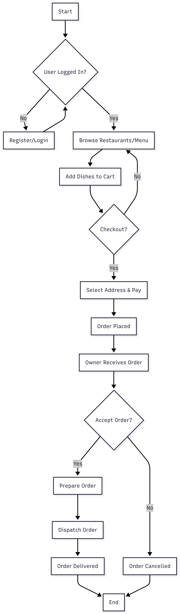
---

## Database Design / Structure

The database is built using **PostgreSQL** (or SQLite for development) with **SQLAlchemy ORM**. The schema is optimized for data integrity and efficient querying.

### Entity Relationship Diagram (ERD)
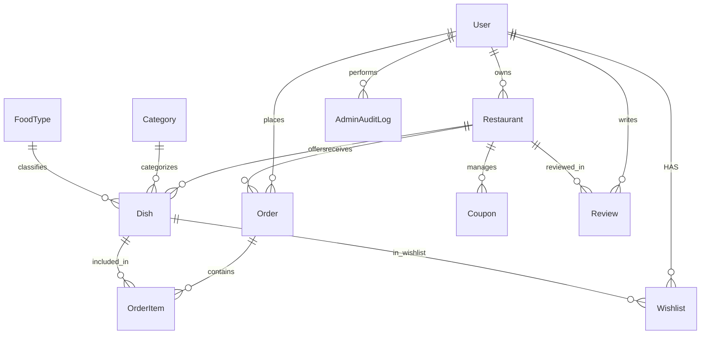
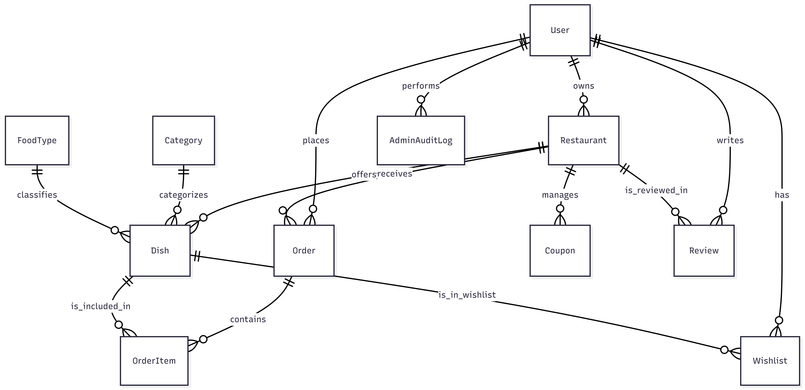

### Table Structure Descriptions

#### 1. Users (`users`)
-   **id**: Primary Key (Integer)
-   **name**: Full name (String)
-   **email**: Unique email address (String, Indexed)
-   **password_hash**: Hashed password (String)
-   **role**: User role: 'customer', 'owner', 'admin' (String, Indexed)
-   **phone/address**: Contact details (String/Text)
-   **is_active**: Boolean flag for account status.

#### 2. Restaurants (`restaurants`)
-   **id**: Primary Key (Integer)
-   **owner_id**: Foreign Key to Users (Integer, Indexed)
-   **name/address/contact**: Basic store info (String/Text)
-   **logo_url**: Cloudinary image URL (String)

#### 3. Dishes (`dishes`)
-   **id**: Primary Key (Integer)
-   **restaurant_id**: Foreign Key to Restaurants (Integer, Indexed)
-   **category_id/food_type_id**: categorization links (Integer, Indexed)
-   **name/description/price**: Item details.
-   **image_url**: Cloudinary image URL (String)

#### 4. Orders (`orders`)
-   **id**: Primary Key (Integer)
-   **customer_id/restaurant_id**: Linking stakeholders (Integer, Indexed)
-   **total_amount**: Decimal amount.
-   **status**: 'pending', 'accepted', 'preparing', 'out for delivery', 'delivered', 'cancelled' (Indexed)
-   **delivery_address**: Text.

#### 5. OrderItems (`order_items`)
-   **id**: Primary Key (Integer)
-   **order_id**: Foreign Key to Orders (Integer, Indexed)
-   **dish_id**: Foreign Key to Dishes (Integer)
-   **quantity/price**: Line item details.

#### 6. Reviews, Wishlists, and AdminAuditLogs
Used respectively for feedback, saving favorites, and tracking administrative actions.

---

## Screen Shots

Below are the key interfaces of the TasteFlow application:

### 1. Home Page
The primary landing page for food discovery.
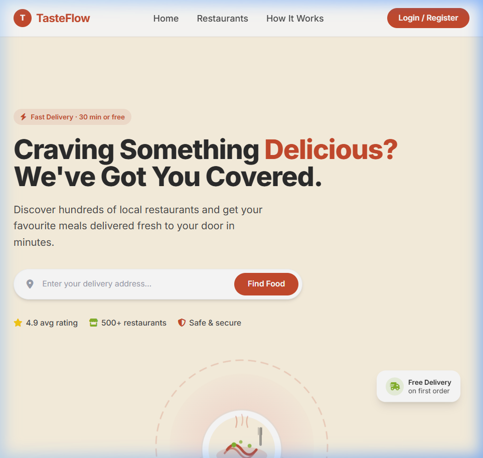

### 2. Login Page
Secure access for all user roles.
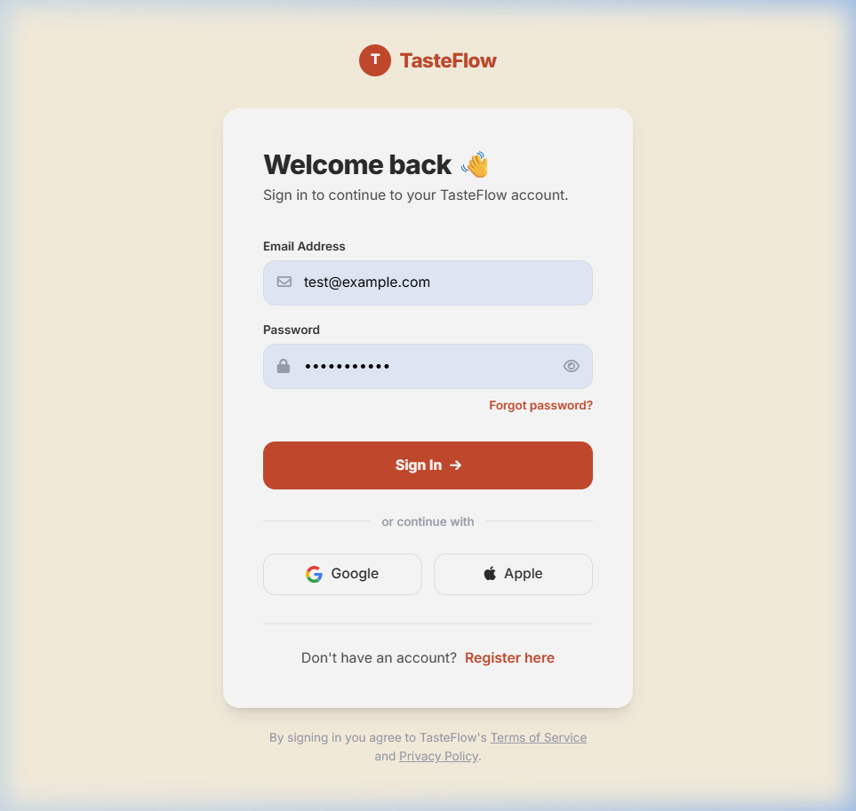

### 3. Customer Dashboard
Where customers browse restaurants and manage their orders.
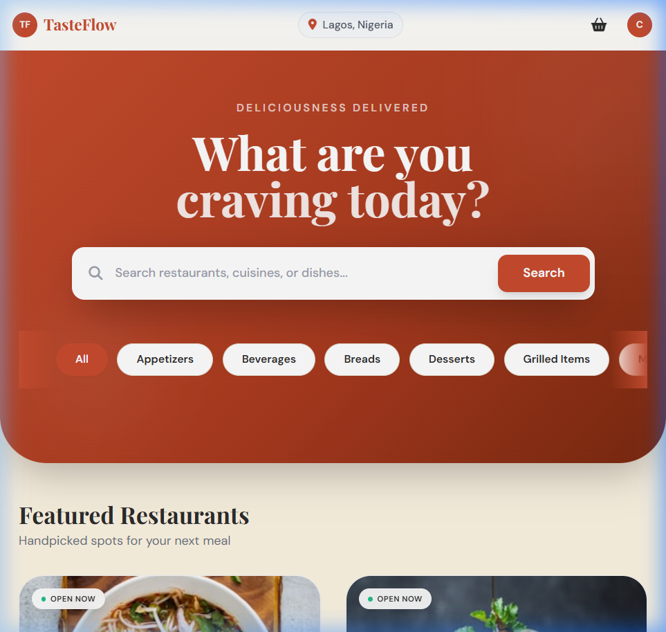

### 4. Owner Dashboard
A comprehensive view for restaurant owners to manage dishes and orders.
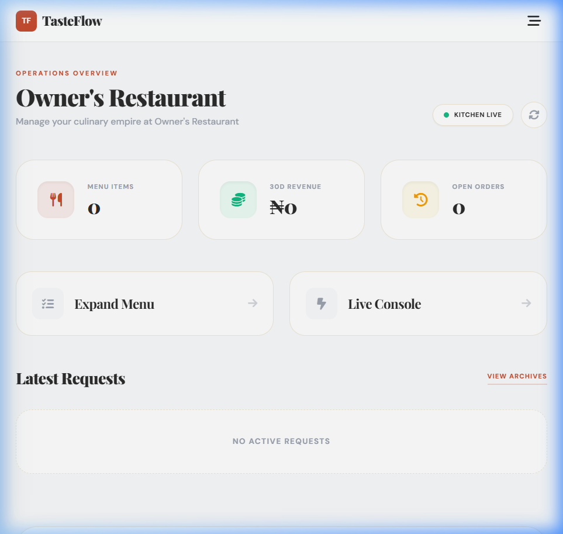

### 5. Admin Dashboard
Administrative oversight and system management.
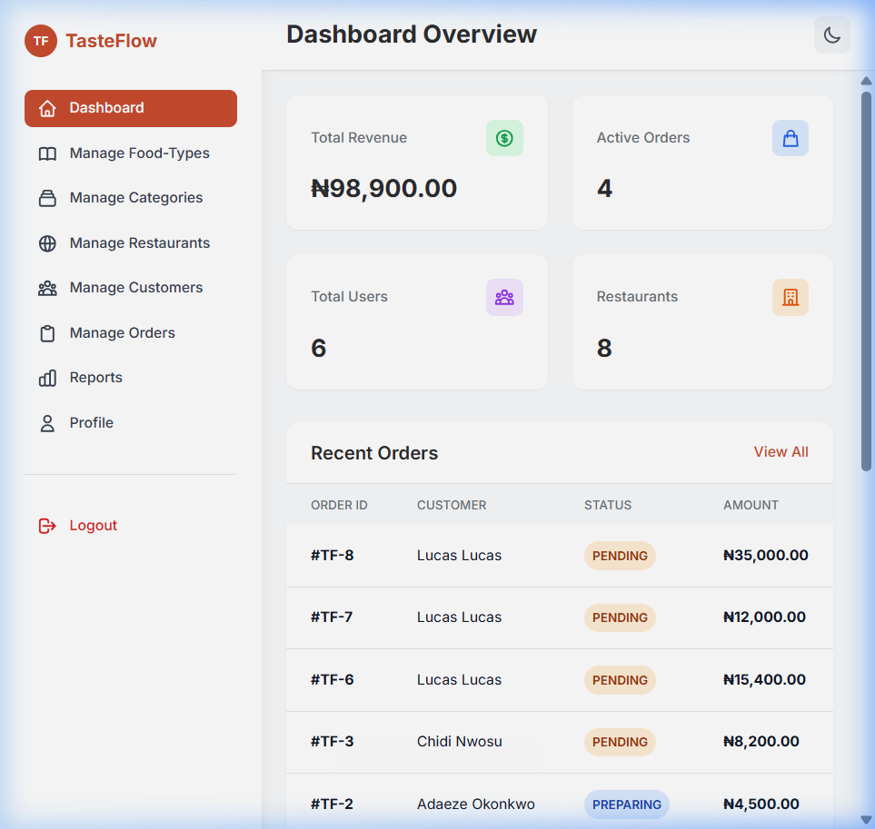

---

## Source Code with Comments

The source code is organized into modular Flask blueprints. Key files including `models.py`, `app/__init__.py`, and various route files in `app/routes/` have been documented with comprehensive comments and docstrings.

---

## User Guide

### For Customers
1.  **Registration**: Sign up by providing your name, email, and address.
2.  **Discovery**: Browse the home page or dashboard to find restaurants and dishes.
3.  **Ordering**: Add items to your cart, proceed to checkout, and confirm your delivery details.
4.  **Tracking**: After placing an order, use the "Track Order" feature to see real-time status updates from the restaurant.

### For Restaurant Owners
1.  **Store Management**: Configure your restaurant details, including name, address, and logo.
2.  **Menu Management**: Add new dishes, set prices, and upload high-quality images.
3.  **Order Fulfillment**: Receive notifications for new orders. Update the status as you "Accept", "Prepare", and "Dispatch" them.

---

## Developer’s Guide

### Technology Stack
-   **Backend**: Python, Flask
-   **Database**: PostgreSQL / SQLite (with SQLAlchemy ORM)
-   **Frontend**: Vanilla CSS, JavaScript (optimized for premium aesthetics)
-   **Media**: Cloudinary (for image/video hosting)

### Module Descriptions
-   **`auth`**: Handles authentication logic, registration, and role-based login.
-   **`customer`**: Manages customer-specific actions like carts, menu browsing, and order tracking.
-   **`owner`**: Provides tools for restaurant management and order processing.
-   **`admin`**: Centralized control panel for system data (Categories, Food Types, Users).
-   **`pages`**: Serves static templates and standard application views.

### Local Setup
1.  **Clone the repository**.
2.  **Install dependencies**: `pip install -r requirements.txt`.
3.  **Environment Setup**: Create a `.env` file with `SECRET_KEY`, `DATABASE_URL`, and `CLOUDINARY_URL`.
4.  **Initialize DB**: `python -m flask init-db`.
5.  **Run**: `python run.py`.
